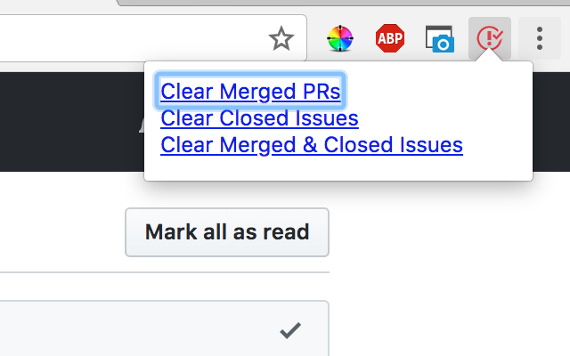

## Github Notification Cleaner

One click removes GitHub notifications for PR's that have been merged, issues that have been closed, or both!

Doesn't require any crazy permissions, uses the [activeTab](https://developer.chrome.com/extensions/activeTab) to only activate on click.

Uses [webextension-polyfill](https://github.com/mozilla/webextension-polyfill) to enable install in Firefox, Edge, and Chrome.

### Webstore Install

* [Chrome Webstore](https://chrome.google.com/webstore/detail/github-notification-clean/nmkolhkahadeccilmcgojcdmjihhakbg)
* Firefox: TODO

### Build / Install Locally:

```
cd extension
yarn
```

#### Chrome:

* [chrome://extensions](chrome://extensions)
  Enable "Developer Mode"
* Click "Load Unpacked Extension"
* Choose the `./extension` directory

#### Firefox:

* [about:debugging](about:debugging)
* "Load Temporary Add-on"
* Select any of the files in extension

#### Screenshot



#### License

MIT
